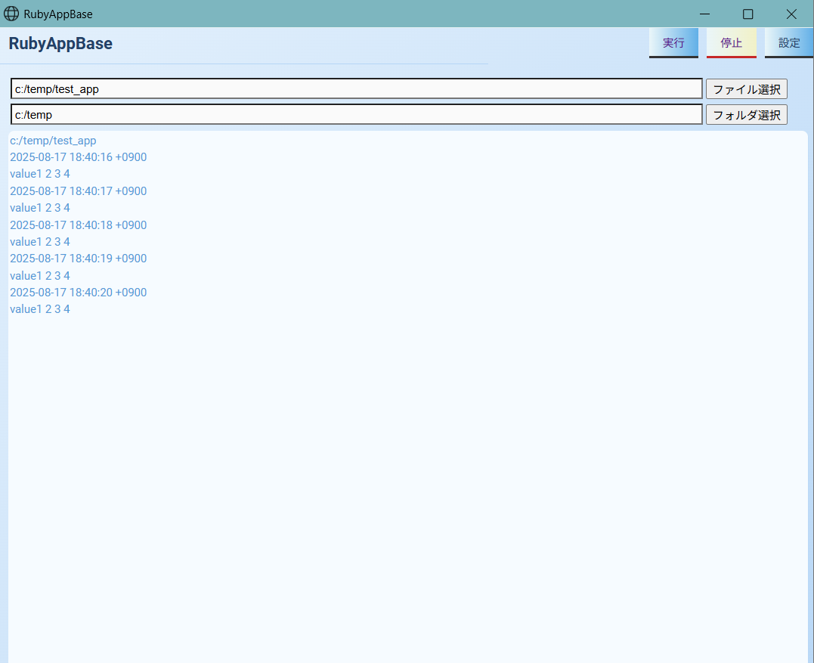
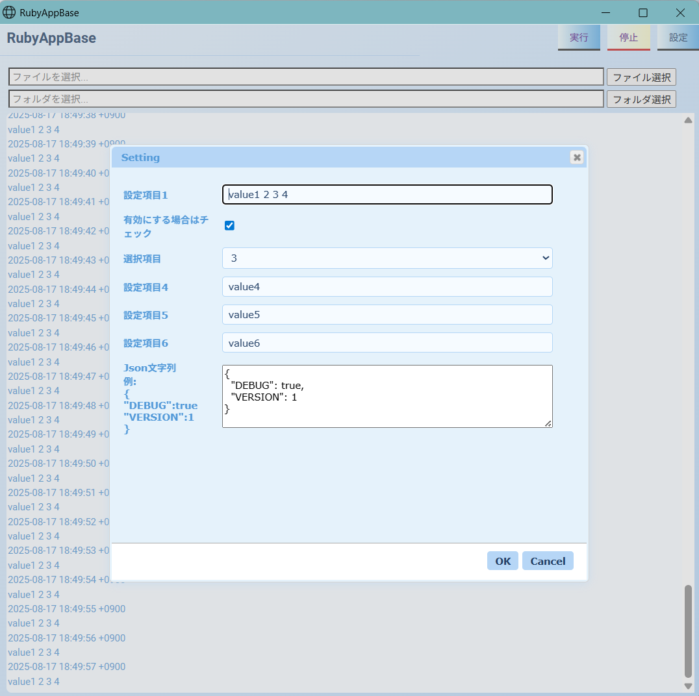

# BrowserAppBase

Windows and Linux browser-based desktop application templates.

You need a Chrome browser to run it.

## Installation

Add this line to your application's Gemfile:

```ruby
gem 'browser_app_base'
```

And then execute:

    $ bundle install

Or install it yourself as:

    $ gem install browser_app_base

## Usage

    create_browser_app [options]
     -d, --dir dir_name               application directory
     -a, --app app_name               application name
     -h, --help                       command help


## Create app templat

    $ create_browser_app -d ~/test/ -a MyApp

## add application code
    $ cd ~/test/
    $ vi my_app.rb

```ruby
    class MyApp < AppMainBase
        def start(argv)
            super
            # add application code
        end

        def stop()
            super
            # add application code
        end
    end
```

ui application sample

    index.html
    css/index.css
    js/main.js

## Start application

```shell
$ /tmp/test/bin/start_my_app.rb
```



## browser setting

    ${home}/${app_nane}/config/browser.json
    Set the path for your Windows or Linux Chrome browser

```json
{
    "chrome_win": "start chrome",
    "chrome_linux": "/bin/google-chrome"
}
```

## Send a message from your browser application to your ruby application

Use the send_message function

main.js sample
```javascript
$("#exec").click(function () {
    send_message("exec:" + $("#upFile").val());
});

```

## Send a message from the ruby application to the browser application

Use the app_send function

my_app_sample.rb sample
```ruby
class MyApp < AppMainBase
  def start(argv)
    # popup message
    app_send("popup:message string")

    # log message
    yield "log message"
    end
end
```

## Application Setting 

    ${home}/${app_nane}/config/setting.json


```json
[
  {
    "name": "name1",
    "value": "value1 2 3 4",
    "type": "input",
    "select": "",
    "description": "設定項目1"
  },
  {
    "name": "name2",
    "value": true,
    "type": "checkbox",
    "select": "",
    "description": "有効にする場合はチェック"
  },
  {
    "name": "name3",
    "value": "2",
    "type": "select",
    "select": [
      "1",
      "2",
      "3",
      "4",
      "5"
    ],
    "description": "選択項目"
  },
  {
    "name": "name4",
    "value": "value4",
    "type": "input",
    "select": "",
    "description": "設定項目4"
  },
  {
    "name": "name5",
    "value": "value5",
    "type": "input",
    "select": "",
    "description": "設定項目5"
  },
  {
    "name": "name6",
    "value": "value6",
    "type": "input",
    "select": "",
    "description": "設定項目6"
  }
]
```
```ruby
class MyApp < AppMainBase
  def start(argv)
    # popup message
    app_send("popup:message string")

    # log message
    yield "log message"
    end

    # read setting
    puts @config["name1"]
end
```

Setting menu


Setting screen


## Development

To install this gem onto your local machine, run `bundle exec rake install`. To release a new version, update the version number in `version.rb`, and then run `bundle exec rake release`, which will create a git tag for the version, push git commits and the created tag, and push the `.gem` file to [rubygems.org](https://rubygems.org).

## Contributing

Bug reports and pull requests are welcome on GitHub at https://github.com/kuwayama1971/BrowserAppBase.

## License

The gem is available as open source under the terms of the [MIT License](https://opensource.org/licenses/MIT).
