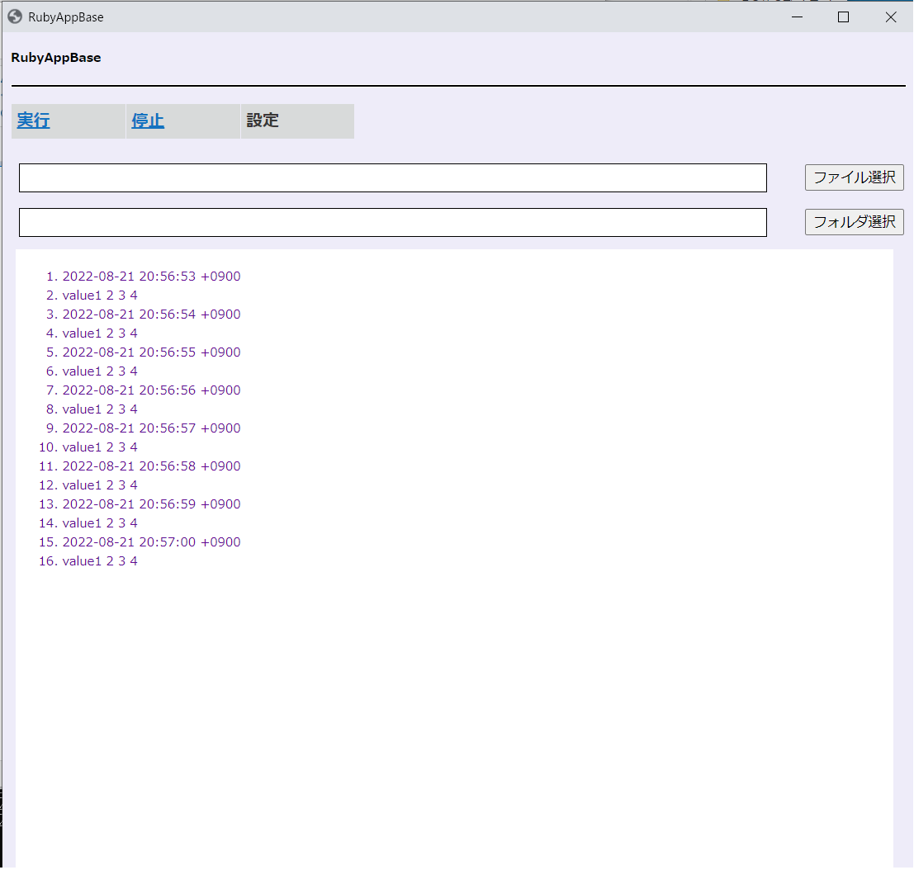
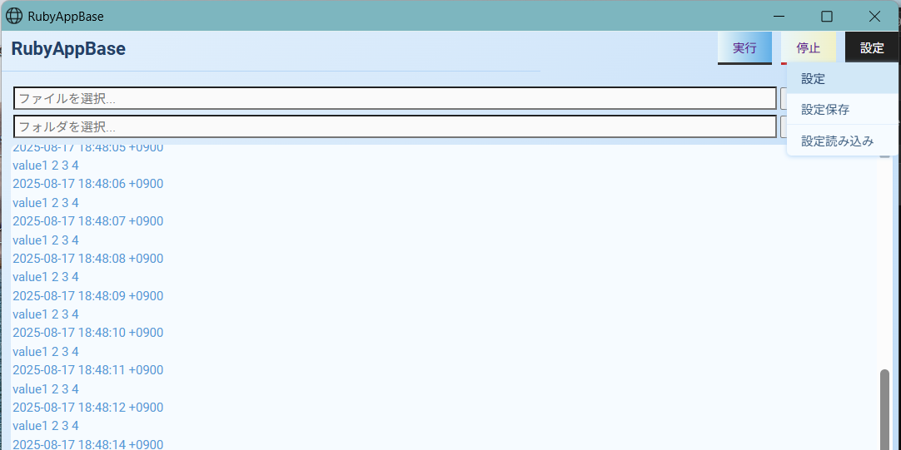
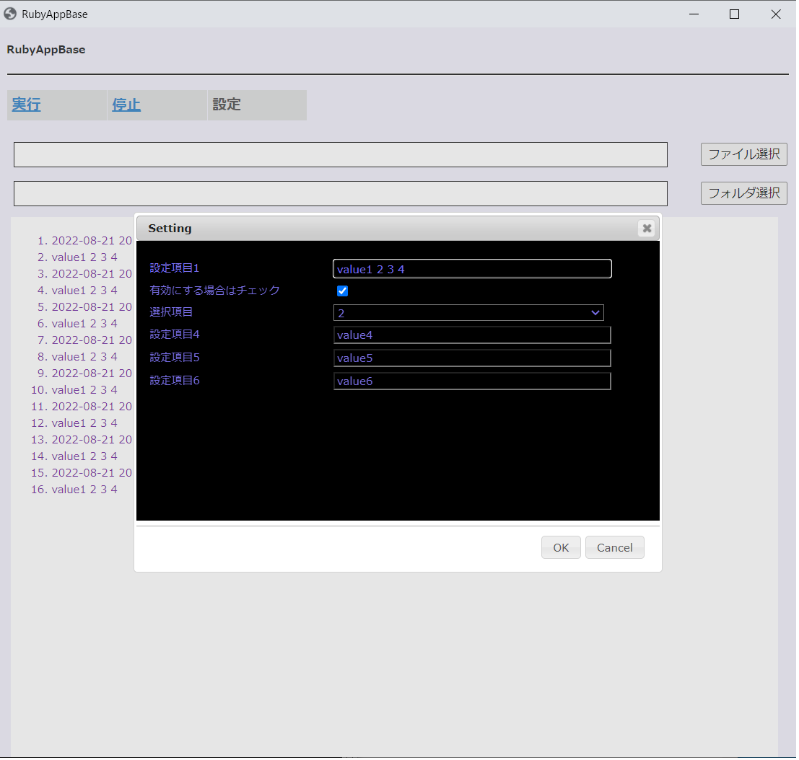

# BrowserAppBase

WindowsおよびLinux向けのブラウザベースデスクトップアプリケーションのテンプレートです。

LinuxではデフォルトでChromeブラウザが使用されます。
WindowsではデフォルトでEdgeブラウザが使用されます。

---

## 機能

- クロスプラットフォームのブラウザベースデスクトップアプリテンプレート（Windows/Linux）
- シンプルなアプリ生成コマンド (`create_browser_app`)
- `setting.json` による柔軟なアプリケーション設定
- ブラウザUIとRubyバックエンド間の通信
- RSpecベースのテストフレームワーク（v0.1.9以降）
- OSごとの簡単なブラウザ設定

---

## 最新の変更点
- Rack 3 をサポートしました
- ruby-lspの環境を追加しました
- Ubuntu用のDockerテスト環境を追加しました

---

## インストール

アプリケーションのGemfileに以下の行を追加します：

```ruby
gem 'browser_app_base'
```

そして実行します：

    $ bundle install

または、直接インストールします：

    $ gem install browser_app_base

---

## 使い方

    create_browser_app [options]
     -d, --dir dir_name               アプリケーションのディレクトリ
     -a, --app app_name               アプリケーション名
     -h, --help                       コマンドのヘルプ

---

## アプリケーションテンプレートの作成

    $ create_browser_app -d /path/to/test/ -a MyApp

---

## アプリケーションコードの追加

    $ cd /path/to/test/
    $ vi my_app.rb

```ruby
class MyApp < AppMainBase
  def start(argv)
    super
    # ここにアプリケーションコードを追加
  end

  def stop()
    super
    # ここにアプリケーションコードを追加
  end
end
```

---

## UIアプリケーションのサンプル

    index.html
    css/index.css
    js/main.js

---

## アプリケーションの起動

```shell
$ /path/to/test/bin/start_my_app.rb
```



---

## ブラウザの設定

WindowsまたはLinux用にブラウザを設定します。

    ${home}/${app_name}/config/browser.json

```json
{
    "chrome_win": "start msedge",
    "chrome_win_": "start chrome",
    "chrome_linux": "/bin/google-chrome"
}
```

---

## ブラウザアプリケーションからRubyアプリケーションへのメッセージ送信

`send_message` 関数を使用します。

main.jsのサンプル：
```javascript
$("#exec").click(function () {
    send_message("exec:" + $("#upFile").val());
});
```

---

## Rubyアプリケーションからブラウザアプリケーションへのメッセージ送信

`app_send` 関数を使用します。

my_app_sample.rbのサンプル：
```ruby
class MyApp < AppMainBase
  def start(argv)
    # ポップアップメッセージ
    app_send("popup:message string")

    # ログメッセージ
    yield "log message"
  end
end
```

---

## アプリケーションの設定

`setting.json` を変更することで設定を追加できます。

    ${home}/${app_name}/config/setting.json

設定例 (`setting.json`):

```json
{
  "version": 0.1,
  "setting_list": [
    {
      "name": "name1",
      "value": "value1 2 3 4",
      "type": "input",
      "select": "",
      "description": "Setting item 1"
    },
    {
      "name": "name2",
      "value": true,
      "type": "checkbox",
      "select": "",
      "description": "Check to enable"
    },
    {
      "name": "name3",
      "value": "3",
      "type": "select",
      "select": [
        "1",
        "2",
        "3",
        "4",
        "5"
      ],
      "description": "Select item"
    },
    {
      "name": "name4",
      "value": "value4",
      "type": "input",
      "select": "",
      "description": "Setting item 4"
    },
    {
      "name": "name5",
      "value": "value5",
      "type": "input",
      "select": "",
      "description": "Setting item 5"
    },
    {
      "name": "name6",
      "value": "value6",
      "type": "input",
      "select": "",
      "description": "Setting item 6"
    },
    {
      "name": "jaon_area",
      "value": {
        "DEBUG": true,
        "VERSION": 1
      },
      "type": "textarea",
      "select": "",
      "description": "JSON string<br>Example:<br>{<br>  \"DEBUG\": true,<br>  \"VERSION\": 1<br>}"
    }
  ]
}
```

Rubyアプリケーションからは以下のように設定にアクセスできます：

```ruby
class MyApp < AppMainBase
  def start(argv)
    # 設定値へのアクセス
    puts @config["name1"]
    # jaon_areaへのハッシュとしてのアクセス
    p @config["jaon_area"] # => {"DEBUG"=>true, "VERSION"=>1}
  end
end
```

---

### setting.jsonの `jaon_area` について

`setting.json` の `jaon_area` 項目を使用すると、設定値としてJSON文字列を入力できます。
このフィールドのタイプは `"textarea"` であり、追加の設定、フラグ、カスタムパラメータなどの柔軟な構造化データを保存することを目的としています。

**例：**
```json
{
  "DEBUG": true,
  "VERSION": 1
}
```

- このフィールドは設定画面で直接編集できます。
- 値は有効なJSON形式である必要があります。
- アプリケーションは必要に応じてこのデータを解析して使用できます。

**使用例：**
- デバッグモードの切り替え (`"DEBUG": true`)
- バージョンや環境情報の保存
- 高度な設定のための任意のキーバリューペアの保存

**Rubyアプリケーションでの使用方法：**
`@config["jaon_area"]` を介してRubyのハッシュとして `jaon_area` の値にアクセスできます。
例：
```ruby
class MyApp < AppMainBase
  def start(argv)
    debug_mode = @config["jaon_area"]["DEBUG"]
    version = @config["jaon_area"]["VERSION"]
    puts "Debug mode: #{debug_mode}, Version: #{version}"
  end
end
```

**注意：**
必ず有効なJSONを入力してください。フォーマットが正しくない場合、アプリケーションが設定を正しく読み込めない可能性があります。

**ヒント：**
- 実行時にアプリケーションが必要とする任意の構造化データを保存するために `jaon_area` を使用できます。
- これは機能フラグ、環境固有の設定、または単純な文字列や真偽値に収まらない高度な設定に便利です。

---

## 設定メニュー
以下の画像はアプリケーションの設定メニューを示しており、ここから様々な設定オプションにアクセスして変更できます。


設定画面
この画像は詳細な設定画面を表示しており、個々の設定項目を編集できます。


---

## Dockerテスト環境

UbuntuでアプリケーションをテストするためのDockerベースのテスト環境が利用可能です。
この設定ではX11フォワーディングを使用して、ホストマシン上にブラウザウィンドウを表示します。

```shell
$ cd test/docker/ubuntu
$ docker-compose up -d
$ docker exec -it ubuntu bash
```

Ubuntu 24.04の場合：
```shell
$ docker-compose -f docker-compose-24.04.yml up -d
```

コンテナ内での操作：
```shell
$ cd /work
$ rake
```

---

## テストの実行

v0.1.9からRSpecベースのテストがサポートされています。
依存関係をインストールした後、以下のコマンドでテストを実行できます：

```sh
bundle install
bundle exec rake
```

または

```sh
RACK_ENV=test bundle exec rspec
```

RSpecタスクは `Rakefile` で定義されているため、`rake` コマンドですべてのテストが自動的に実行されます。
テストコードは `spec/` ディレクトリの下に配置してください。

---

## 開発

このgemをローカルマシンにインストールするには、`bundle exec rake install` を実行します。
新しいバージョンをリリースするには、`version.rb` でバージョン番号を更新し、`bundle exec rake release` を実行します。これによりバージョンのgitタグが作成され、gitコミットと作成されたタグがプッシュされ、`.gem` ファイルが [rubygems.org](https://rubygems.org) にプッシュされます。

---

## コントリビューション

バグレポートとプルリクエストはGitHubの [https://github.com/kuwayama1971/BrowserAppBase](https://github.com/kuwayama1971/BrowserAppBase) で歓迎します。

---

## ライセンス

このgemは [MIT License](https://opensource.org/licenses/MIT) の条件の下でオープンソースとして利用可能です。
